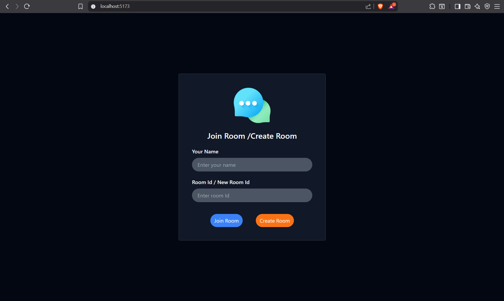
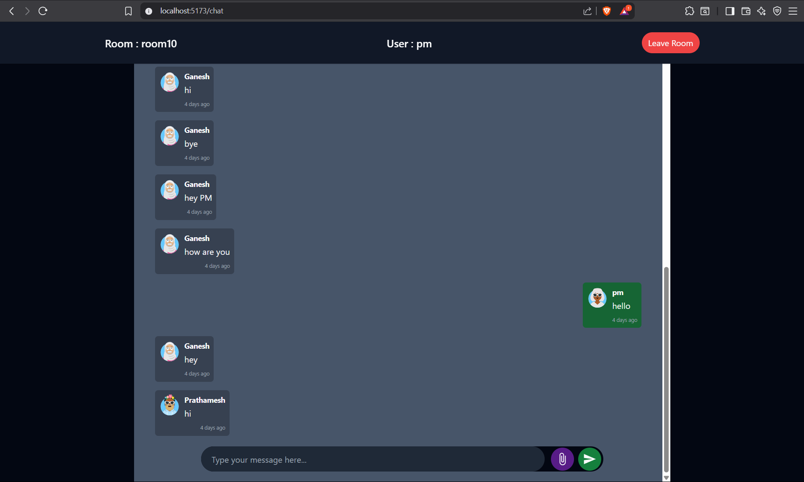

# 💬 Spring Boot Group Chat Application

A real-time web-based group chat application built using **Spring Boot**, **WebSocket**, **MongoDB**, and **ReactJS**. Users can create or join chat rooms and exchange messages instantly.

---

## 📌 Features

- ✅ Create new chat rooms with a unique ID.
- ✅ Join existing chat rooms using room ID.
- ✅ View previously saved chat messages on room entry.
- ✅ Real-time messaging for all users in a room via WebSockets.
- ✅ Persist all messages in MongoDB for future reference.
- ✅ Simple and responsive user interface.

---

## 🛠️ Technologies Used

### Backend:
- Java 24
- Spring Boot
- Spring Web
- Spring Data MongoDB
- WebSocket (STOMP over SockJS)
- Maven

### Frontend:
- ReactJS
- WebSocket (client-side)
- Tailwind CSS (or custom CSS styling)
- Vite for react

### Database:
- MongoDB (NoSQL)

---

## 📸 Screenshots

### 📋 Join - Create Room UI


### 💬 Live Chat UI


---

## 🚀 Getting Started

### Prerequisites
- Java
- Maven
- Node.js and npm/yarn
- MongoDB running locally or on the cloud
- Postman for API testing

### 📦 Backend Setup (Spring Boot)

1. Clone the repository.
2. Replace any invalid package names (e.g., change `com.prathamesh.chat.chat-app` to `com.prathamesh.chat.chat_app`)
3. Configure MongoDB URI in `application.properties`:

   ```properties
   spring.data.mongodb.uri=mongodb://localhost:27017/chatapp
4. install requirements.txt
5. Check and replace frontend port addresses
6. Run ChatAppApplication.java file

### 📦 Frontend Setup (Vite + React)

1. Navigate to the frontend directory.
2. install requirements.txt
3. Check and replace backend port addresses
4. Run command "npm run dev"

###  Now Application is running and you can use it.

### Note:- Further i'm hosting it on Cloud using docker
